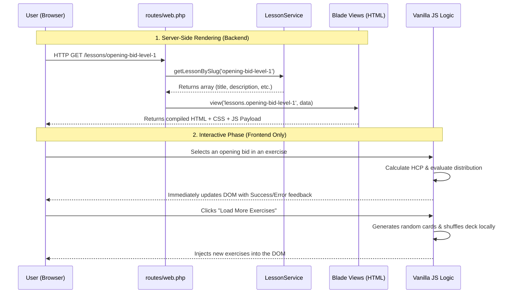

# System Architecture

This document describes the high-level architecture of the Bridge Lessons application.

## Overview
The application follows a **Monolithic Server-Side Rendered (SSR)** architecture using Laravel for the backend, combined with a **Vanilla JS & Tailwind CSS** frontend for dynamic interactivity.

## Components

### ⚙️ Backend (Laravel / PHP)
The backend is lightweight and handles routing, data provisioning, and HTML generation:
1. **Routing:** `routes/web.php` captures incoming HTTP requests for the home page (`/`) and specific lessons (`/lessons/{slug}`).
2. **Data Layer (In-Memory):** Instead of a database, the application relies on `App\Services\LessonService.php`. This acts as a mock repository containing a static array of bridge lessons.
3. **View Rendering:** Route closures directly call `LessonService`, fetch the data, and pass it to **Blade Templates** (like `landing.blade.php` or `opening-bid-level-1.blade.php`).
4. **Component System:** Blade components (like `<x-layout>` and `<x-lesson-card>`) handle reusable layout wrappers and UI elements.

### 🎨 Frontend (Browser / JS / HTML / Tailwind)
The frontend receives the fully constructed HTML from the server and handles user interactions autonomously:
1. **Styling:** **Tailwind CSS v4** (bundled via Vite) is used for all UI styling, including responsive layouts and dark mode support.
2. **Rich Interactivity:** All logic for the exercises is shipped to the browser.
3. **Client-Side Processing:** In files like `opening-bid-level-1.blade.php`, Vanilla JavaScript completely takes over the interactive exercises. It calculates High Card Points (HCP), validates correct bids based on Bridge rules, generates random hands, and updates the DOM to display feedback—**all without communicating with the backend.**

## Data Flow

## Architectural Decisions

- **Zero-API approach:** By keeping the logic for exercises in the frontend, the application feels snappy (zero latency for feedback) and requires no complex API state management or CSRF handling for these interactions.
- **Service-based data:** Encapsulating lesson data in `LessonService` allows for easy migration to a database (Eloquent) in the future without changing the routing or view logic.
- **Tailwind v4:** Using the latest Tailwind version for modern, efficient styling.
